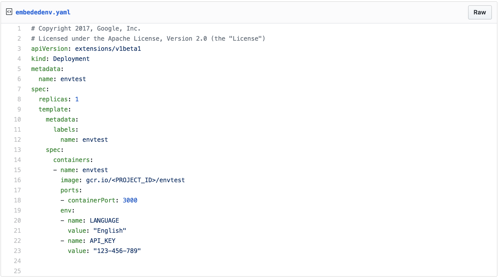

# How to override environment variables for containers.
You might have a need to customize you containers for different environments (Dev, Test, Staging, Production).

There are many things you can consider to parameterize like datasource url, api keys...

One of the good practices is to use environment variables.

